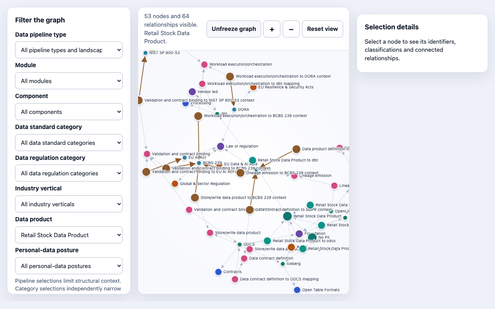

# Data Landscape knowledge model

Inspired by [Dr Simon Harrer](https://www.data-landscape.com/)’s Data Landscape, I wanted a way to join the open-standards map to the regulation map, so an architect can ask of a real pipeline which standards apply and which UK and EU obligations are relevant, with sources. I originally donated the regulation sub-landscape; Simon has since curated it. The catalogues remain his, and Entropy Data’s, under the MIT licence. This repository is my derived model of those catalogues, prepared with Enterprise Solutions Consulting Ltd.

**Licence:** catalogue data © Entropy Data, MIT; transformation by Mark McCalla. Retain [LICENSE](LICENSE) and [ATTRIBUTION.md](ATTRIBUTION.md) if you redistribute the package.

## Data Products

Open [`graph.html`](graph.html) in a browser as a local file. No server is required. Choose a **Data product** to scope the view. The figure below is Retail Stock Data Product.

I ran Entropy Data’s shelf-warmers demo through the model to see what a real product looks like on that path. The product ties cleanly to ODPS, ODCS and dbt. OpenLineage and Iceberg are explicit no-coverage mappings for this example: lineage emission exists as a pipeline capability, but this curated product does not adopt it, and the demo is a Snowflake table rather than Iceberg. The regulation entries stay thin; the product is marked no PII and low risk.

Three worked examples among twelve curated products:

- **Retail Stock Data Product** (`retail`, no PII) — consider ODPS, ODCS and dbt. Regulatory considerations stay thin on purpose. OpenLineage and Iceberg are explicit no-coverage mappings: this example does not adopt lineage emission, and the Entropy shelf-warmers-inspired demo is a Snowflake table rather than Iceberg.
- **Banking Customer Data Product** (`banking`, PII) — consider ODPS, ODCS and OpenLineage, plus GDPR and DORA as design prompts for UK/EU financial-services audiences.
- **Health Customer Data Product** (`health`, PII) — consider ODPS and ODCS, plus HIPAA as a design prompt for care-setting products that may hold protected health information.

Further examples cover insurance policy and claims (ISO 27001 on claims), capital-markets trades (Iceberg, OpenLineage, BCBS 239), wealth portfolios (BCBS 239 without OpenLineage), retail loyalty (CCPA/CPRA), hospital admissions, care-home residents (GDPR), public-sector reference codes (JSON Schema, DCAT, ISO 11179) and telecoms subscribers (NIS2).

Each consideration is a sourced mapping node (same provenance pattern as component mappings), not a bare “uses” or “relevant” edge. Vertical and personal-data posture are inspection aids, not legal determinations of applicability. Vertical selectors change the consideration neighbourhood in a human-explainable way; OpenLineage is not hung on every product for symmetry.

## Data Pipelines

An architect choosing how to ingest data — for example CDC of EU personal data in a bank — still too often picks a tool, names a standard in a slide, and discovers the regulation later. In 2026 the same pipelines may sit under GDPR, DORA, NIS2 and the AI Act. This model records those links so they can be inspected rather than reconstructed from slides. The catalogues remain the public reference: [data-landscape.com](https://www.data-landscape.com/) and the [regulation map](https://www.data-landscape.com/regulation.html). What this package adds is a queryable path through them: ingestion pattern → component → standard and regulatory context, each statement carrying an evidence grade.

Open [`graph.html`](graph.html) in a browser as a local file. No server is required. Choose a **Data pipeline type** to scope the view. The figure below is Batch file ingestion.

The package details and counts are in the [package overview](docs/00-package-overview.md). How to run the checks is in [Contributors](docs/contributors.md). How to rebuild [`graph.html`](graph.html) is in [Rebuild the standalone graph](docs/rebuild-graph.md).

## Important limitations

- This package is not legal advice.
- A mapping is not proof that an organisation, system or processing activity complies.
- Industry vertical and personal-data posture on curated products are inspection aids, not legal sector classification or applicability determinations.
- Status text may contain edition and applicability information but is not converted into legal lifecycle dates.
- Only mappings supported by the cited official sources are included.
- Source descriptions and editorial wording remain attributable to the upstream landscape.
- Historical snapshots require an explicit versioning extension.

## Attribution and responsible reuse

Catalogue data and publisher-authored wording are © Entropy Data, MIT, from Simon Harrer’s Data Landscape. The regulation sub-landscape was originally donated by Mark McCalla and has since been curated by Simon Harrer. This GitHub repository is Mark McCalla’s derived model. Retain [`ATTRIBUTION.md`](ATTRIBUTION.md), [`CITATION.bib`](CITATION.bib) and [`LICENSE`](LICENSE) when redistributing this package or a substantial part of its data.

## External standards and documentation

- [W3C SKOS Reference](https://www.w3.org/TR/skos-reference/)
- [W3C SHACL Recommendation](https://www.w3.org/TR/shacl/)
- [Neo4j constraints](https://neo4j.com/docs/cypher-manual/current/constraints/)
- [NIST CSF Informative References](https://www.nist.gov/cyberframework/informative-references)
- [European Data Protection Board code-of-conduct register](https://www.edpb.europa.eu/registers/register-of-consistency-and-of-accountability-tools/codes-of-conduct_en)
