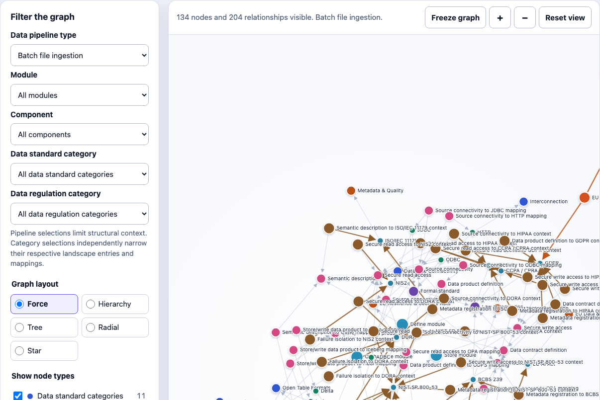

# Data Landscape knowledge model

A schema-first knowledge model of the Data Landscape catalogues published by [Simon Harrer](https://www.data-landscape.com/) and Entropy Data under the MIT licence. Mark McCalla originally donated the regulation sub-landscape, which Simon has since curated. This repository is Mark McCalla’s derived model of those catalogues, prepared with Enterprise Solutions Consulting Ltd.

**Licence:** catalogue data © Entropy Data, MIT; transformation by Mark McCalla. Retain [LICENSE](LICENSE) and [ATTRIBUTION.md](ATTRIBUTION.md) if you redistribute the package.

The intended use is straightforward. An architect choosing how to ingest data — for example CDC of EU personal data in a bank — needs to know which open standards apply to the pipeline components, and which UK and EU obligations are relevant to those components, with sources. In 2026 the same pipelines may sit under GDPR, DORA, NIS2 and the AI Act. This model records those links so they can be inspected rather than reconstructed in slides.

The catalogues remain the public reference: [data-landscape.com](https://www.data-landscape.com/) and the [regulation map](https://www.data-landscape.com/regulation.html). This package adds a queryable structure over them: ingestion pattern → component → standard and regulatory context, each statement carrying an evidence grade.

Open [`graph.html`](graph.html) in a browser as a local file. No server is required. Choose a **Data pipeline type** to scope the view. The figure below is Batch file ingestion.



The work is aimed at:

- UK and EU enterprise and data architects in financial services, insurance and the public sector, who select standards and then need the regulatory context;
- data platform and data-mesh consultants who currently maintain this mapping in presentations;
- readers already using Entropy Data or ODCS, for whom this is adjacent context.

The model currently covers **84** Data Standard Landscape entries (81 from upstream and three source-backed extensions) and **73** Data Regulation Landscape entries. Official crosswalks are the three assertions that have a cited source.

## Start with the four layers

Treat the package as a governed catalogue:

1. **Ontology:** the types of things and relationships that may exist.
2. **Taxonomy:** the approved classification values and their hierarchy.
3. **SHACL:** the data-quality rules that publishable records must pass.
4. **Instances:** the landscape entries and sourced mappings.

The Neo4j CSV and Cypher files project the same model into a labelled property graph.

```text
Ontology → Taxonomy → SHACL → Instances → Neo4j projection
```

Schema is defined before instances are published.

## The model in one picture

```text
LandscapeEntry
├── DataStandardLandscapeEntry
│   ├── IN_STANDARD_CATEGORY ──→ StandardCategory
│   ├── HAS_GOVERNANCE_TYPE ──→ GovernanceType
│   └── HAS_ASSESSMENT ───────→ LandscapeAssessment
│                                ├── JUDGED_AS ──→ Judgement
│                                └── HAS_TIER ──→ Tier
│
└── DataRegulationLandscapeEntry
    ├── IN_REGULATION_CATEGORY → RegulationCategory
    ├── APPLIES_IN ────────────→ Jurisdiction
    └── HAS_GOVERNANCE_TYPE ───→ GovernanceType

ComplianceMapping
├── SOURCE_ENTRY ──────────────→ LandscapeEntry
├── TARGET_ENTRY ──────────────→ LandscapeEntry
├── HAS_MAPPING_RELATION ──────→ MappingRelation
└── HAS_AUTHORITY_TYPE ────────→ MappingAuthorityType

ComponentRegulatoryMapping
├── MAPS_COMPONENT_TYPE ───────→ DataPipelineComponent
└── REGULATORY_CONTEXT ────────→ DataRegulationLandscapeEntry

DataIngestionPattern
├── BatchFileIngestion
├── APIPullIngestion
├── EventDrivenIngestion
├── DatabaseCDCIngestion
├── ObjectStoreReplication
└── TableFormatStreaming
    └── HAS_MODULE ─────────────→ DataPipelineModule
                                  └── HAS_COMPONENT ──→ DataPipelineComponent

Attestation
├── pipelineId / moduleId / componentId / timestamp
├── PERFORMED_BY ───────────────→ Actor
├── RECORDS_ACTION ─────────────→ Action ←── RISK_FOR_ACTION ── Risk
├── RECORDS_CONTROL ────────────→ Control ── MITIGATES_RISK ──→ Risk
└── RECORDS_EVIDENCE ───────────→ ControlEvidence ── EVIDENCE_FOR_CONTROL ──→ Control
```

Subclass names record membership in a landscape. A `DataRegulationLandscapeEntry` may be a law, a standard, a control catalogue or an assurance scheme. `GovernanceType` records how the entry is established or stewarded.

## Why the assessment is separate

Adopt, Assess, Situational and Caution are publisher opinions about Data Standard Landscape entries. They can change without changing the entry itself.

The regulation landscape does not use those judgements or tiers. Relevance there depends on jurisdiction and context.

## Why mappings are separate nodes

An official crosswalk has its own authority, version, status and supporting URL. A `ComplianceMapping` records that assertion as a node, so authority and source stay attached to the link rather than being implied by the two entries.

The package includes three such mappings, each with a cited official source:

- CSA CCM maps to NIST CSF;
- CSA CCM maps to ISO/IEC 27001;
- the approved EU Cloud Code of Conduct supports evidence relating to GDPR compliance.

## Package contents

| Artefact | Purpose | Walkthrough |
|---|---|---|
| [`ontology.ttl`](ontology.ttl) | Classes, properties and relationship meanings. | [Ontology](docs/01-ontology.md) |
| [`taxonomy.ttl`](taxonomy.ttl) | Categories, judgements, tiers, governance types, jurisdictions and mapping terms. | [Taxonomy](docs/02-taxonomy.md) |
| [`shapes.ttl`](shapes.ttl) | Validation rules for entries, assessments, concepts and mappings. | [SHACL](docs/03-shacl.md) |
| [`instances.ttl`](instances.ttl) | Data Standard Landscape entries and assessments. | [Instances](docs/04-instances.md) |
| [`regulation-instances.ttl`](regulation-instances.ttl) | Data Regulation Landscape entries. | [Instances](docs/04-instances.md) |
| [`mapping-instances.ttl`](mapping-instances.ttl) | Officially supported mapping assertions. | [Mappings](docs/10-compliance-mappings.md) |
| [`component-mappings.ttl`](component-mappings.ttl) | Curated implementation options linking pipeline components to landscape entries. | [Instances](docs/04-instances.md) |
| [`component-regulatory-mappings.ttl`](component-regulatory-mappings.ttl) | Curated, primary-source-backed regulatory context for pipeline components. | [Mappings](docs/10-compliance-mappings.md) |
| [`graph.html`](graph.html) | Standalone D3 visualisation with node-type filters and pipeline-scoped views. | Open directly in a browser. |
| [`nodes.csv`](nodes.csv) | Neo4j nodes for all RDF resources. | [Neo4j CSV](docs/05-neo4j-csv.md) |
| [`relationships.csv`](relationships.csv) | Neo4j relationships. | [Neo4j CSV](docs/05-neo4j-csv.md) |
| [`neo4j-schema.cypher`](neo4j-schema.cypher) | Neo4j keys, constraints and indexes. | [Neo4j schema](docs/06-neo4j-schema.md) |
| [`ATTRIBUTION.md`](ATTRIBUTION.md) | Authorship, reuse and transformation boundary. | [Attribution](ATTRIBUTION.md) |
| [`CITATION.bib`](CITATION.bib) | BibTeX citations. | [Citation](CITATION.bib) |
| [`SOURCE-MANIFEST.md`](SOURCE-MANIFEST.md) | Input URLs, record counts and checksums. | [Source manifest](SOURCE-MANIFEST.md) |
| [`standard-extensions.json`](standard-extensions.json) | The three locally curated, officially sourced standard entries. | [Source manifest](SOURCE-MANIFEST.md) |
| [`LICENSE`](LICENSE) | Dual MIT notice: catalogue data © Entropy Data; derived model © Mark McCalla. | [Licence](LICENSE) |

## Suggested reading paths

### I have a pipeline pattern and need the attached obligations

1. Open [`graph.html`](graph.html) and scope a pipeline type.
2. [Compliance mappings](docs/10-compliance-mappings.md)
3. [Design decisions](docs/08-design-decisions.md)

### I am completely new to knowledge modelling

1. [Glossary](docs/09-glossary.md)
2. [Ontology](docs/01-ontology.md)
3. [Taxonomy](docs/02-taxonomy.md)
4. [SHACL](docs/03-shacl.md)
5. [Instances](docs/04-instances.md)
6. [Design decisions](docs/08-design-decisions.md)

### I want to use the Neo4j projection

1. [Neo4j CSV projection](docs/05-neo4j-csv.md)
2. [Neo4j schema](docs/06-neo4j-schema.md)
3. [Loading and validation](docs/07-loading-and-validation.md)

### I need the schema and validation rules

1. [Glossary](docs/09-glossary.md)
2. [Ontology](docs/01-ontology.md)
3. [Taxonomy](docs/02-taxonomy.md)
4. [SHACL](docs/03-shacl.md)
5. [Instances](docs/04-instances.md)

## Counts and reconciliation

| Measure | Count |
|---|---:|
| Data Standard Landscape records | 84 |
| Upstream / locally extended standard records | 81 / 3 |
| Unique standard display names | 83 |
| Standard category memberships | 85 |
| Data Regulation Landscape records | 73 |
| Regulation categories | 19 |
| Regulation category memberships | 73 |
| Normalised jurisdiction memberships | 81 |
| Confirmed cross-landscape identity links | 2 pairs: ODRL and OPA |
| Official mapping assertions | 3 |
| Component implementation mappings | 29 |
| Component regulatory mappings | 33 |
| Neo4j nodes | 414 |
| Neo4j relationships | 963 |

Compound jurisdiction labels explain why 73 regulation entries produce 81 jurisdiction memberships. For example, `EU / Germany` becomes links to both European Union and Germany, while the original text is kept.

## Direct, normalised and modelled information

The `evidenceStatus` value records how a statement entered the graph:

- `DIRECT_OBSERVATION`: present in the supplied landscape data;
- `NORMALISED_FROM_SOURCE`: deterministically split or normalised from a source value;
- `IDENTITY_CONFIRMED`: a reviewed cross-landscape identity link;
- `OFFICIAL_SOURCE`: supported by a separately identified official document;
- `MODELLED_VOCABULARY`: terminology introduced by this model;
- `OFFICIAL_SOURCE_EXTENSION`: a local landscape extension grounded in official product documentation;
- `EDITORIAL_ASSESSMENT`: a locally curated judgement and tier rather than an upstream statement;
- `CURATED_DESIGN_MAPPING`: a design-time implementation option, not a claim of complete capability coverage.
- `CURATED_REGULATORY_RELEVANCE`: a curated component-to-requirement relevance assertion grounded in a primary source; not regulator endorsement and not proof of compliance.

## Namespace

IRIs minted for this derived model use:

```text
https://polymathic.co.uk/data-landscape/ontology/
https://polymathic.co.uk/data-landscape/taxonomy/
https://polymathic.co.uk/data-landscape/instance/
```

## Important limitations

- This package is not legal advice.
- A mapping is not proof that an organisation, system or processing activity complies.
- Status text may contain edition and applicability information but is not converted into legal lifecycle dates.
- Only mappings supported by the cited official sources are included.
- Source descriptions and editorial wording remain attributable to the upstream landscape.
- Historical snapshots require an explicit versioning extension.

## Attribution and responsible reuse

Catalogue data and publisher-authored wording are © Entropy Data, MIT, from Simon Harrer’s Data Landscape. The regulation sub-landscape was originally donated by Mark McCalla and has since been curated by Simon Harrer. This GitHub repository is Mark McCalla’s derived model. Retain [`ATTRIBUTION.md`](ATTRIBUTION.md), [`CITATION.bib`](CITATION.bib) and [`LICENSE`](LICENSE) when redistributing this package or a substantial part of its data.

## External standards and documentation

- [W3C SKOS Reference](https://www.w3.org/TR/skos-reference/)
- [W3C SHACL Recommendation](https://www.w3.org/TR/shacl/)
- [Neo4j constraints](https://neo4j.com/docs/cypher-manual/current/constraints/)
- [NIST CSF Informative References](https://www.nist.gov/cyberframework/informative-references)
- [European Data Protection Board code-of-conduct register](https://www.edpb.europa.eu/registers/register-of-consistency-and-of-accountability-tools/codes-of-conduct_en)

## Contributor checks

The repository uses [pre-commit](https://pre-commit.com/) for hygiene, secret safety, cruft rejection, Turtle validation (`riot`), SHACL (`pyshacl`), and Neo4j CSV projection integrity. Install and enable it once:

```sh
python3 -m pip install pre-commit pyshacl
# Apache Jena riot must also be on PATH (see docs/07-loading-and-validation.md)
pre-commit install
```

Run every configured check against the complete repository before submitting a change:

```sh
pre-commit run --all-files
```

`graph.html` is excluded from text hygiene hooks because it is a generated standalone artefact of about 800KB. Domain hooks map to the scripts under `scripts/check-*.py` and follow the [loading and validation guide](docs/07-loading-and-validation.md).

## Rebuild the standalone graph

[`graph.html`](graph.html) contains D3 and the complete CSV projection inline, so it opens locally without a web server or network connection. Rebuild it after changing either CSV file:

```sh
npm install
npm run build
npm test
```
